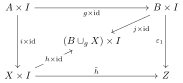

This post is not supposed to introduce anything new, but rather to illuminate an aspect about cofibrations. The proposition is in May[^1]. This post also doubles as a test of whether TikZ diagrams render properly in blog posts :)

Firstly, notice that for a given diagram $$K: J\to C$$ into a locally small category, the limit $$\lim_{J^\mathsf{op}} C(K-, X)$$ for some object $$X$$ is just a collection of objects acting as cones of $$K$$ with nadir $$X$$, meaning that
\\[
    \lim_{J^\mathsf{op}} C(K-, X) \cong \text{Cone} (F, X)
\\]
Since colimits are just representations of such functors of appropriate variance, we have that
\\[
    \lim_{J^\mathsf{op}} C(K-, X) \cong C(\text{colim} _J K, X)
\\]

Now, as a corollary of this, we can show that left adjoints preserve said colimits (and right adjoints preserve limits). The following argument will be sufficient: Let $$F: C \dashv D: G$$ be an adjunction, and let $$K: J\to C$$ be a diagram.

$$ \begin{align*}
    D(F(\text{colim} _J K), d) &\cong C(\text{colim} _J K, Gd)\\
    &\cong \lim_{J^\mathsf{op}} C(K, Gd)\\ &\cong \lim_{J?^Sop} D(FK, d)\\
    &\cong D(\text{colim} _J FK, d)
\end{align*} $$

Now, by the fact that the Yoneda embedding $$y: D^\mathsf{op} \to \mathsf{Set}$$ is a fully-faithful embedding, we get that $$F(\text{colim} K) \cong \text{colim} FK$$.

Finally, before we can start the main point of the post, we note the following fact, and make another note on the notation to clarify some things:

* Fixing the space $$I := [0, 1] \in \mathsf{cgHaus}$$ in the category of compactly-generated Hausdorff spaces, by the fact that this category is Cartesian Closed, we have an adjunction $$-\times I : \mathsf{cgHaus} \dashv \mathsf{cgHaus} : -^I$$. Thus, for any diagram $$K: J\to \mathsf{cgHaus}$$, it is the case that $$(\text{colim} K)\times I \cong \text{colim} (K\times I)$$.
* A note for pushouts: Following standard notation, note that for any pushout $$B \cup_g X$$, the above fact takes the following form in notation: $$(B \cup_g X)\times I \cong (B\times I)\cup_{g\times \text{id}} (X\times I)$$.

Finally, we are ready to show the following proposition:
**Proposition**: Let $$i: A\to X$$ be a cofibration, and $$g: A\to B$$ any map. Then the induced inclusion $$j: B\to B\cup_g X$$ is a cofibration. (Some notes on notation: the maps $$i_0$$ indicate $$1_Z \times \{0\}$$, and $$\text{id}$$ is a special notation for the specific identity $$1_I$$.)

The following is a test diagram of $$i$$ with the pushout diagram for $$B\cup_g X$$:

<!-- https://q.uiver.app/?q=WzAsNixbMiwwLCJBXFx0aW1lcyBJIl0sWzIsMiwiWFxcdGltZXMgSSJdLFswLDEsIkEiXSxbNCwxLCJCIl0sWzAsMywiWCJdLFs0LDMsIkJcXGN1cF9nIFgiXSxbMiw0LCJpIl0sWzIsMCwiaV8wIiwyXSxbMCwxLCJpXFx0aW1lcyBcXG1hdGhzZntpZH0iLDIseyJsYWJlbF9wb3NpdGlvbiI6MzB9XSxbNCwxLCJpXzAiXSxbMiwzLCJnIiwwLHsibGFiZWxfcG9zaXRpb24iOjcwfV0sWzMsNSwiaiJdLFs0LDUsImgiXSxbNSwyLCIiLDAseyJzdHlsZSI6eyJuYW1lIjoiY29ybmVyLWludmVyc2UifX1dXQ== -->
<iframe class="quiver-embed" src="https://q.uiver.app/?q=WzAsNixbMiwwLCJBXFx0aW1lcyBJIl0sWzIsMiwiWFxcdGltZXMgSSJdLFswLDEsIkEiXSxbNCwxLCJCIl0sWzAsMywiWCJdLFs0LDMsIkJcXGN1cF9nIFgiXSxbMiw0LCJpIl0sWzIsMCwiaV8wIiwyXSxbMCwxLCJpXFx0aW1lcyBcXG1hdGhzZntpZH0iLDIseyJsYWJlbF9wb3NpdGlvbiI6MzB9XSxbNCwxLCJpXzAiXSxbMiwzLCJnIiwwLHsibGFiZWxfcG9zaXRpb24iOjcwfV0sWzMsNSwiaiJdLFs0LDUsImgiXSxbNSwyLCIiLDAseyJzdHlsZSI6eyJuYW1lIjoiY29ybmVyLWludmVyc2UifX1dXQ==&embed" width="745" height="560" style="border-radius: 8px; border: none;"></iframe>

Now, we can carry the pushout diagram along the functor $$-\times I$$ to obtain a new pushout:

<!-- https://q.uiver.app/?q=WzAsOCxbMiwwLCJBXFx0aW1lcyBJIl0sWzIsMiwiWFxcdGltZXMgSSJdLFswLDEsIkEiXSxbNCwxLCJCIl0sWzAsMywiWCJdLFs0LDMsIkJcXGN1cF9nIFgiXSxbNiwwLCJCXFx0aW1lcyBJIl0sWzYsMiwiKEJcXGN1cF9nIFgpXFx0aW1lcyBJIl0sWzIsNCwiaSJdLFsyLDAsImlfMCIsMl0sWzAsMSwiaVxcdGltZXMgXFxtYXRoc2Z7aWR9IiwyLHsibGFiZWxfcG9zaXRpb24iOjMwfV0sWzQsMSwiaV8wIl0sWzIsMywiZyIsMCx7ImxhYmVsX3Bvc2l0aW9uIjo3MH1dLFszLDUsImoiXSxbNCw1LCJoIl0sWzUsMiwiIiwwLHsic3R5bGUiOnsibmFtZSI6ImNvcm5lci1pbnZlcnNlIn19XSxbMyw2LCJpXzAiXSxbNiw3LCJqXFx0aW1lcyBcXG1hdGhzZntpZH0iXSxbNSw3LCJpXzAiXV0= -->
<iframe class="quiver-embed" src="https://q.uiver.app/?q=WzAsOCxbMiwwLCJBXFx0aW1lcyBJIl0sWzIsMiwiWFxcdGltZXMgSSJdLFswLDEsIkEiXSxbNCwxLCJCIl0sWzAsMywiWCJdLFs0LDMsIkJcXGN1cF9nIFgiXSxbNiwwLCJCXFx0aW1lcyBJIl0sWzYsMiwiKEJcXGN1cF9nIFgpXFx0aW1lcyBJIl0sWzIsNCwiaSJdLFsyLDAsImlfMCIsMl0sWzAsMSwiaVxcdGltZXMgXFxtYXRoc2Z7aWR9IiwyLHsibGFiZWxfcG9zaXRpb24iOjMwfV0sWzQsMSwiaV8wIl0sWzIsMywiZyIsMCx7ImxhYmVsX3Bvc2l0aW9uIjo3MH1dLFszLDUsImoiXSxbNCw1LCJoIl0sWzUsMiwiIiwwLHsic3R5bGUiOnsibmFtZSI6ImNvcm5lci1pbnZlcnNlIn19XSxbMyw2LCJpXzAiXSxbNiw3LCJqXFx0aW1lcyBcXG1hdGhzZntpZH0iXSxbNSw3LCJpXzAiXV0=&embed" width="1118" height="560" style="border-radius: 8px; border: none;"></iframe>

Let's complete our test diagram by some new morphisms through $$I$$ and a test object $$Z$$:

<!-- https://q.uiver.app/?q=WzAsOSxbMiwwLCJBXFx0aW1lcyBJIl0sWzIsMiwiWFxcdGltZXMgSSJdLFswLDEsIkEiXSxbNCwxLCJCIl0sWzAsMywiWCJdLFs0LDMsIkJcXGN1cF9nIFgiXSxbNiwwLCJCXFx0aW1lcyBJIl0sWzYsMiwiKEJcXGN1cF9nIFgpXFx0aW1lcyBJIl0sWzcsMywiWiJdLFsyLDQsImkiXSxbMiwwLCJpXzAiLDJdLFswLDEsImlcXHRpbWVzIFxcbWF0aHNme2lkfSIsMix7ImxhYmVsX3Bvc2l0aW9uIjozMH1dLFs0LDEsImlfMCJdLFsyLDMsImciLDAseyJsYWJlbF9wb3NpdGlvbiI6NzB9XSxbMyw1LCJqIiwwLHsibGFiZWxfcG9zaXRpb24iOjMwfV0sWzQsNSwiaCJdLFs1LDIsIiIsMCx7InN0eWxlIjp7Im5hbWUiOiJjb3JuZXItaW52ZXJzZSJ9fV0sWzMsNiwiaV8wIl0sWzYsNywialxcdGltZXMgXFxtYXRoc2Z7aWR9Il0sWzUsNywiaV8wIl0sWzUsOCwiXFx2YXJlcHNpbG9uXzAiXSxbNiw4LCJcXHZhcmVwc2lsb25fMSIsMCx7ImN1cnZlIjotM31dLFsxLDcsImhcXHRpbWVzIFxcbWF0aHNme2lkfSIsMCx7ImxhYmVsX3Bvc2l0aW9uIjozMH1dLFswLDYsImdcXHRpbWVzIFxcbWF0aHNme2lkfSJdXQ== -->
<iframe class="quiver-embed" src="https://q.uiver.app/?q=WzAsOSxbMiwwLCJBXFx0aW1lcyBJIl0sWzIsMiwiWFxcdGltZXMgSSJdLFswLDEsIkEiXSxbNCwxLCJCIl0sWzAsMywiWCJdLFs0LDMsIkJcXGN1cF9nIFgiXSxbNiwwLCJCXFx0aW1lcyBJIl0sWzYsMiwiKEJcXGN1cF9nIFgpXFx0aW1lcyBJIl0sWzcsMywiWiJdLFsyLDQsImkiXSxbMiwwLCJpXzAiLDJdLFswLDEsImlcXHRpbWVzIFxcbWF0aHNme2lkfSIsMix7ImxhYmVsX3Bvc2l0aW9uIjozMH1dLFs0LDEsImlfMCJdLFsyLDMsImciLDAseyJsYWJlbF9wb3NpdGlvbiI6NzB9XSxbMyw1LCJqIiwwLHsibGFiZWxfcG9zaXRpb24iOjMwfV0sWzQsNSwiaCJdLFs1LDIsIiIsMCx7InN0eWxlIjp7Im5hbWUiOiJjb3JuZXItaW52ZXJzZSJ9fV0sWzMsNiwiaV8wIl0sWzYsNywialxcdGltZXMgXFxtYXRoc2Z7aWR9Il0sWzUsNywiaV8wIl0sWzUsOCwiXFx2YXJlcHNpbG9uXzAiXSxbNiw4LCJcXHZhcmVwc2lsb25fMSIsMCx7ImN1cnZlIjotM31dLFsxLDcsImhcXHRpbWVzIFxcbWF0aHNme2lkfSIsMCx7ImxhYmVsX3Bvc2l0aW9uIjozMH1dLFswLDYsImdcXHRpbWVzIFxcbWF0aHNme2lkfSJdXQ==&embed" width="1246" height="560" style="border-radius: 8px; border: none;"></iframe>

Notice the maps $$\varepsilon_0 h = \varepsilon_1 \circ g\times \text{id} $$. Since $$i: A\to X$$ is a cofibration, we have a map $$\tilde h : X\times I \to Z$$ commuting with both these maps. But then, as $$(B\cup_g X)\times I$$ is also the pushout $$(B\times I) \cup_{g\times \text{id}} (X\times I)$$, there is a unique map $$k: (B\cup_g X)\times I \to Z$$ commuting the following diagram:

<!-- https://q.uiver.app/?q=WzAsNSxbMCwwLCJBXFx0aW1lcyBJIl0sWzIsMCwiQlxcdGltZXMgSSJdLFswLDIsIlhcXHRpbWVzIEkiXSxbMiwyLCJaIl0sWzEsMSwiKEJcXGN1cF9nIFgpXFx0aW1lcyBJIl0sWzIsMywiXFx0aWxkZSBoIl0sWzEsMywiXFx2YXJlcHNpbG9uXzEiXSxbMCwxLCJnXFx0aW1lcyBcXG1hdGhzZntpZH0iXSxbMiw0LCJoXFx0aW1lcyBcXG1hdGhzZntpZH0iLDFdLFsxLDQsImpcXHRpbWVzIFxcbWF0aHNme2lkfSIsMV0sWzAsMiwiaVxcdGltZXMgXFxtYXRoc2Z7aWR9IiwyXSxbNCwzLCJcXGV4aXN0cyFrIiwwLHsic3R5bGUiOnsiYm9keSI6eyJuYW1lIjoiZGFzaGVkIn19fV1d -->
<iframe class="quiver-embed" src="https://q.uiver.app/?q=WzAsNSxbMCwwLCJBXFx0aW1lcyBJIl0sWzIsMCwiQlxcdGltZXMgSSJdLFswLDIsIlhcXHRpbWVzIEkiXSxbMiwyLCJaIl0sWzEsMSwiKEJcXGN1cF9nIFgpXFx0aW1lcyBJIl0sWzIsMywiXFx0aWxkZSBoIl0sWzEsMywiXFx2YXJlcHNpbG9uXzEiXSxbMCwxLCJnXFx0aW1lcyBcXG1hdGhzZntpZH0iXSxbMiw0LCJoXFx0aW1lcyBcXG1hdGhzZntpZH0iLDFdLFsxLDQsImpcXHRpbWVzIFxcbWF0aHNme2lkfSIsMV0sWzAsMiwiaVxcdGltZXMgXFxtYXRoc2Z7aWR9IiwyXSxbNCwzLCJcXGV4aXN0cyFrIiwwLHsic3R5bGUiOnsiYm9keSI6eyJuYW1lIjoiZGFzaGVkIn19fV1d&embed" width="584" height="432" style="border-radius: 8px; border: none;"></iframe>

which is exactly what we needed for $$j$$ to be a cofibration.

[^1]: May's Concise Course in Algebraic Topology, chapter 6.
